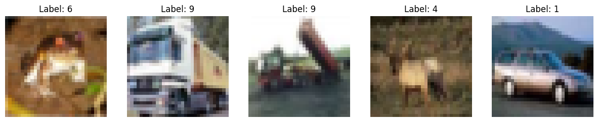
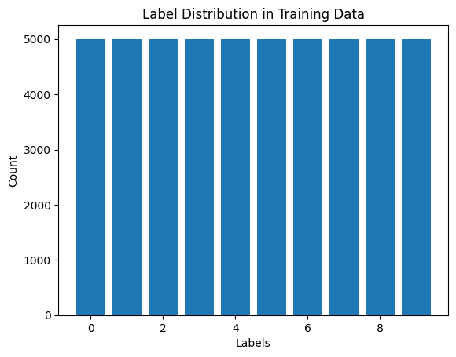
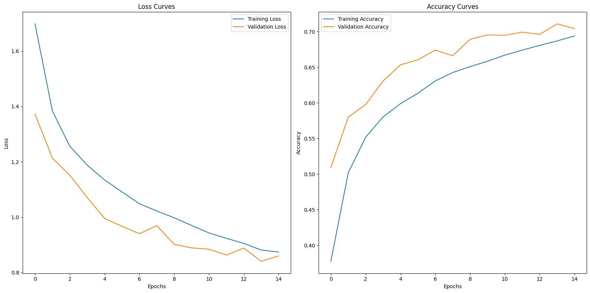
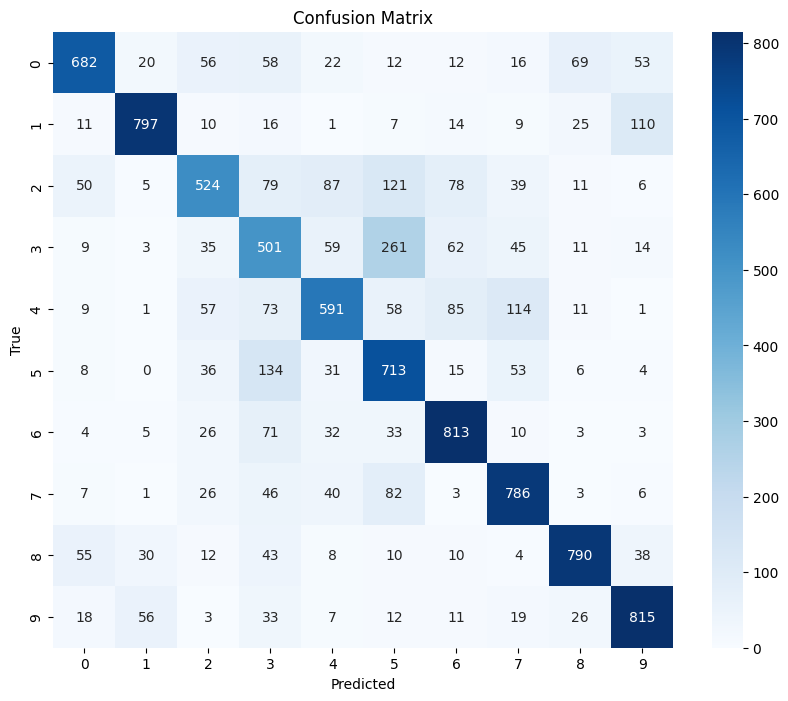
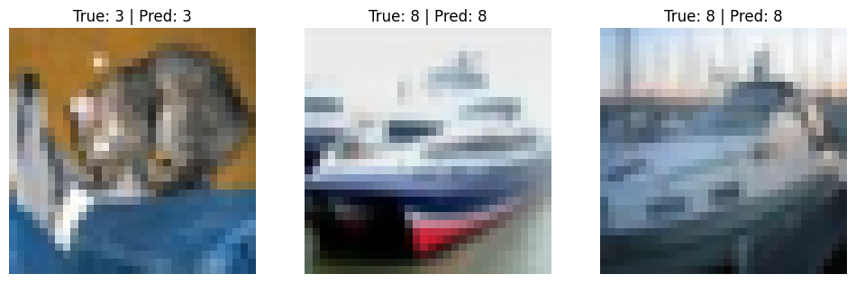
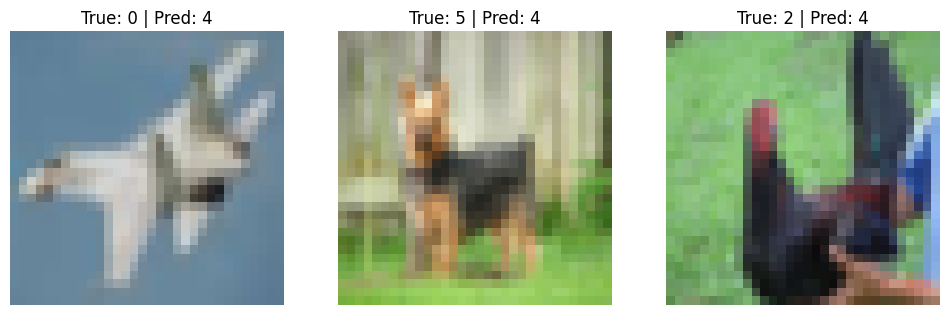

# Assignment: Image Classification Using CNNs


```python
# Import necessary libraries
import numpy as np
import matplotlib.pyplot as plt
from tensorflow.keras.datasets import cifar10
from tensorflow.keras import Input
from tensorflow.keras.models import Sequential
from tensorflow.keras.layers import Conv2D, MaxPooling2D, Flatten, Dense, Dropout
from sklearn.metrics import classification_report, confusion_matrix
import seaborn as sns
from sklearn.model_selection import train_test_split
import pandas as pd
```

## Load CIFAR-10 Dataset


```python
(X_train, y_train), (X_test, y_test) = cifar10.load_data()
```

    Downloading data from https://www.cs.toronto.edu/~kriz/cifar-10-python.tar.gz
    170498071/170498071 ━━━━━━━━━━━━━━━━━━━━ 3s 0us/step
    

## Task 1: Data Exploration and Preparation

### 1. Display 5 images along with their corresponding labels


```python
# Display 5 sample images with labels
fig, axes = plt.subplots(1, 5, figsize=(15, 5))
for i in range(5):
    axes[i].imshow(X_train[i])
    axes[i].set_title(f"Label: {y_train[i][0]}")
    axes[i].axis('off')
plt.show()
```


    

    


### 2. Print the shape of dataset and count of unique labels


*   Training data has 50,000 images. Each image is 32x32 pixels with Red, Green and Blue channels.
*   Similarly, the test data has 10,000 images.
*   There are 10 unique labels ranging from 0 to 10.


```python
 print("Training data shape:", X_train.shape)
 print("Test data shape:", X_test.shape)
 print("Unique labels:", np.unique(y_train))
```

    Training data shape: (50000, 32, 32, 3)
    Test data shape: (10000, 32, 32, 3)
    Unique labels: [0 1 2 3 4 5 6 7 8 9]
    


*   There are 5000 records for each label.


```python
# Count the occurrences of each label in the training dataset
unique_labels, label_counts = np.unique(y_train, return_counts=True)

plt.bar(unique_labels, label_counts)
plt.xlabel("Labels")
plt.ylabel("Count")
plt.title("Label Distribution in Training Data")
plt.show()
```


    

    


### 3. Normalize the image pixel values to 0 -1 range


```python
# Normalize pixel values
X_train = X_train / 255.0
X_test = X_test / 255.0
```

### 4. Split dataset into training and testing sets


```python
X_train, X_val, y_train, y_val = train_test_split(X_train, y_train, test_size=0.2, random_state=42)
```

## Task 2: Build and Train a CNN Model

### 1. Design a simple CNN model


```python
# Define the CNN model
model = Sequential([
    Input(shape=(32, 32, 3)),
    Conv2D(32, (3, 3), activation='relu', input_shape=(32, 32, 3)),
    MaxPooling2D((2, 2)),
    Dropout(0.2),

    Conv2D(64, (3, 3), activation='relu'),
    MaxPooling2D((2, 2)),
    Dropout(0.3),

    Flatten(),
    Dense(128, activation='relu'),
    Dropout(0.4),
    Dense(10, activation='softmax')  # Output layer for 10 classes
])
```


1.   Input layer: - Accepts 32x32 pixel RGB images
2.   Conv2D: 32 filters of size 3x3 with ReLU activation function.
3.   Maxpooling2D: Reduce dimensions of input image using a 2x2 window.
4.   Dropout: Rate 0.2 helps prevent overfitting.
5.   Points 2 to 3 are repeated again with 64 filters of size 3x3, maxpooling of 2x2 and dropout rate of 0.3.
6.   Flatten layer converts 2D feature maps into 1D feature vectors.
7.   Dense to create fully connected hidden layers with 128 neurons using ReLU activation function and 10 neurons using softmax activation for multiclass classification.


### 2. Compile the model


```python
model.compile(
    optimizer='adam',
    loss='sparse_categorical_crossentropy',
    metrics=['accuracy']
)
```

### 3. Train model on training sets


```python
history = model.fit(
    X_train, y_train,
    validation_data=(X_val, y_val),
    epochs=15,
    batch_size=64
)
```

    Epoch 1/15
    625/625 ━━━━━━━━━━━━━━━━━━━━ 62s 94ms/step - accuracy: 0.2945 - loss: 1.9104 - val_accuracy: 0.5090 - val_loss: 1.3724
    Epoch 2/15
    625/625 ━━━━━━━━━━━━━━━━━━━━ 55s 88ms/step - accuracy: 0.4899 - loss: 1.4155 - val_accuracy: 0.5799 - val_loss: 1.2133
    Epoch 3/15
    625/625 ━━━━━━━━━━━━━━━━━━━━ 81s 87ms/step - accuracy: 0.5454 - loss: 1.2665 - val_accuracy: 0.5976 - val_loss: 1.1515
    Epoch 4/15
    625/625 ━━━━━━━━━━━━━━━━━━━━ 54s 86ms/step - accuracy: 0.5762 - loss: 1.1957 - val_accuracy: 0.6305 - val_loss: 1.0710
    Epoch 5/15
    625/625 ━━━━━━━━━━━━━━━━━━━━ 84s 88ms/step - accuracy: 0.5994 - loss: 1.1364 - val_accuracy: 0.6532 - val_loss: 0.9956
    Epoch 6/15
    625/625 ━━━━━━━━━━━━━━━━━━━━ 80s 85ms/step - accuracy: 0.6148 - loss: 1.0914 - val_accuracy: 0.6603 - val_loss: 0.9672
    Epoch 7/15
    625/625 ━━━━━━━━━━━━━━━━━━━━ 82s 85ms/step - accuracy: 0.6332 - loss: 1.0354 - val_accuracy: 0.6740 - val_loss: 0.9404
    Epoch 8/15
    625/625 ━━━━━━━━━━━━━━━━━━━━ 82s 85ms/step - accuracy: 0.6462 - loss: 1.0129 - val_accuracy: 0.6660 - val_loss: 0.9696
    Epoch 9/15
    625/625 ━━━━━━━━━━━━━━━━━━━━ 84s 88ms/step - accuracy: 0.6553 - loss: 0.9883 - val_accuracy: 0.6891 - val_loss: 0.9019
    Epoch 10/15
    625/625 ━━━━━━━━━━━━━━━━━━━━ 80s 85ms/step - accuracy: 0.6592 - loss: 0.9716 - val_accuracy: 0.6953 - val_loss: 0.8892
    Epoch 11/15
    625/625 ━━━━━━━━━━━━━━━━━━━━ 83s 87ms/step - accuracy: 0.6698 - loss: 0.9345 - val_accuracy: 0.6948 - val_loss: 0.8843
    Epoch 12/15
    625/625 ━━━━━━━━━━━━━━━━━━━━ 54s 87ms/step - accuracy: 0.6787 - loss: 0.9130 - val_accuracy: 0.6991 - val_loss: 0.8632
    Epoch 13/15
    625/625 ━━━━━━━━━━━━━━━━━━━━ 53s 85ms/step - accuracy: 0.6823 - loss: 0.9021 - val_accuracy: 0.6961 - val_loss: 0.8885
    Epoch 14/15
    625/625 ━━━━━━━━━━━━━━━━━━━━ 84s 88ms/step - accuracy: 0.6931 - loss: 0.8653 - val_accuracy: 0.7108 - val_loss: 0.8405
    Epoch 15/15
    625/625 ━━━━━━━━━━━━━━━━━━━━ 53s 85ms/step - accuracy: 0.6939 - loss: 0.8747 - val_accuracy: 0.7042 - val_loss: 0.8603
    

### 4. Training and validation loss and accuracy curves


```python
fig, axes = plt.subplots(1, 2, figsize=(16, 8))

# Plot training and validation curves
axes[0].plot(history.history['loss'], label='Training Loss')
axes[0].plot(history.history['val_loss'], label='Validation Loss')
axes[0].set_xlabel('Epochs')
axes[0].set_ylabel('Loss')
axes[0].set_title('Loss Curves')
axes[0].legend()

axes[1].plot(history.history['accuracy'], label='Training Accuracy')
axes[1].plot(history.history['val_accuracy'], label='Validation Accuracy')
axes[1].set_xlabel('Epochs')
axes[1].set_ylabel('Accuracy')
axes[1].set_title('Accuracy Curves')
axes[1].legend()

plt.tight_layout()
plt.show()
```


    

    


*   Both training and validation loss decrease steadily over epochs
*   Validation loss is slightly lower than training loss at the end of training.
*   Both training and validation accuracy increases steadily.
*   Validation accuracy is slightly higher that training accuracy at the end of training.
*   Since training and validation losses are close to each other, this means the model generalizes well to unseen data.
*   The training and validation accuracy are also quite close, indicating that the model is learning effectively and not memorizing the training data.


## Task 3. Evaluate the Model

### 1. Evaluate on test set and get accuracy


```python
test_loss, test_accuracy = model.evaluate(X_test, y_test)
print(f"Test accuracy: {test_accuracy * 100:.2f}%")
```

    313/313 ━━━━━━━━━━━━━━━━━━━━ 4s 12ms/step - accuracy: 0.7046 - loss: 0.8643
    Test accuracy: 70.12%
    

### 2. Confusion matrix and classification report


```python
y_pred = np.argmax(model.predict(X_test), axis=-1)
```

    313/313 ━━━━━━━━━━━━━━━━━━━━ 4s 12ms/step
    


```python
print("Classification Report:\n", classification_report(y_test, y_pred))
```

    Classification Report:
                   precision    recall  f1-score   support
    
               0       0.80      0.68      0.74      1000
               1       0.87      0.80      0.83      1000
               2       0.67      0.52      0.59      1000
               3       0.48      0.50      0.49      1000
               4       0.67      0.59      0.63      1000
               5       0.54      0.71      0.62      1000
               6       0.74      0.81      0.77      1000
               7       0.72      0.79      0.75      1000
               8       0.83      0.79      0.81      1000
               9       0.78      0.81      0.80      1000
    
        accuracy                           0.70     10000
       macro avg       0.71      0.70      0.70     10000
    weighted avg       0.71      0.70      0.70     10000
    
    


*   71% of predictions are correct.


```python
cm = confusion_matrix(y_test, y_pred)
plt.figure(figsize=(10, 8))
sns.heatmap(cm, annot=True, fmt='d', cmap='Blues', xticklabels=np.arange(10), yticklabels=np.arange(10))
plt.xlabel("Predicted")
plt.ylabel("True")
plt.title("Confusion Matrix")
plt.show()
```


    

    


### 3. Examples of correctly and incorrectly classified images


```python
# Identify correctly and incorrectly classified images
correct_indices = np.where(y_pred == y_test.flatten())[0]
incorrect_indices = np.where(y_pred != y_test.flatten())[0]

# Plot 3 correctly classified images
print("Correctly Classified Examples:")
fig, axes = plt.subplots(1, 3, figsize=(12, 4))
for i, idx in enumerate(correct_indices[:3]):
    axes[i].imshow(X_test[idx])
    axes[i].set_title(f"True: {y_test[idx][0]} | Pred: {y_pred[idx]}")
    axes[i].axis('off')
plt.show()

# Plot 3 incorrectly classified images
print("Incorrectly Classified Examples:")
fig, axes = plt.subplots(1, 3, figsize=(12, 4))
for i, idx in enumerate(incorrect_indices[:3]):
    axes[i].imshow(X_test[idx])
    axes[i].set_title(f"True: {y_test[idx][0]} | Pred: {y_pred[idx]}")
    axes[i].axis('off')
plt.show()
```

    Correctly Classified Examples:
    


    

    


    Incorrectly Classified Examples:
    


    

    


## Task 4. Experimentation with model improvements


```python
for optimizer in ['sgd', 'rmsprop']:
    print(f"Using Optimizer: {optimizer}")
    model.compile(optimizer=optimizer, loss='sparse_categorical_crossentropy', metrics=['accuracy'])
    model.fit(X_train, y_train, validation_data=(X_val, y_val), epochs=15, batch_size=64)
```

    Using Optimizer: sgd
    Epoch 1/15
    625/625 ━━━━━━━━━━━━━━━━━━━━ 56s 88ms/step - accuracy: 0.6305 - loss: 1.0468 - val_accuracy: 0.6674 - val_loss: 0.9758
    Epoch 2/15
    625/625 ━━━━━━━━━━━━━━━━━━━━ 81s 87ms/step - accuracy: 0.6518 - loss: 0.9936 - val_accuracy: 0.6641 - val_loss: 1.0125
    Epoch 3/15
    625/625 ━━━━━━━━━━━━━━━━━━━━ 81s 86ms/step - accuracy: 0.6557 - loss: 0.9922 - val_accuracy: 0.6826 - val_loss: 0.9298
    Epoch 4/15
    625/625 ━━━━━━━━━━━━━━━━━━━━ 83s 87ms/step - accuracy: 0.6654 - loss: 0.9696 - val_accuracy: 0.6778 - val_loss: 0.9345
    Epoch 5/15
    625/625 ━━━━━━━━━━━━━━━━━━━━ 81s 85ms/step - accuracy: 0.6662 - loss: 0.9591 - val_accuracy: 0.6818 - val_loss: 0.9210
    Epoch 6/15
    625/625 ━━━━━━━━━━━━━━━━━━━━ 83s 87ms/step - accuracy: 0.6686 - loss: 0.9424 - val_accuracy: 0.6879 - val_loss: 0.9049
    Epoch 7/15
    625/625 ━━━━━━━━━━━━━━━━━━━━ 80s 84ms/step - accuracy: 0.6667 - loss: 0.9541 - val_accuracy: 0.6857 - val_loss: 0.9110
    Epoch 8/15
    625/625 ━━━━━━━━━━━━━━━━━━━━ 84s 87ms/step - accuracy: 0.6691 - loss: 0.9464 - val_accuracy: 0.6886 - val_loss: 0.9061
    Epoch 9/15
    625/625 ━━━━━━━━━━━━━━━━━━━━ 53s 85ms/step - accuracy: 0.6723 - loss: 0.9373 - val_accuracy: 0.6888 - val_loss: 0.8972
    Epoch 10/15
    625/625 ━━━━━━━━━━━━━━━━━━━━ 83s 87ms/step - accuracy: 0.6721 - loss: 0.9335 - val_accuracy: 0.6839 - val_loss: 0.9135
    Epoch 11/15
    625/625 ━━━━━━━━━━━━━━━━━━━━ 80s 84ms/step - accuracy: 0.6777 - loss: 0.9283 - val_accuracy: 0.6950 - val_loss: 0.8846
    Epoch 12/15
    625/625 ━━━━━━━━━━━━━━━━━━━━ 84s 87ms/step - accuracy: 0.6712 - loss: 0.9362 - val_accuracy: 0.6867 - val_loss: 0.9107
    Epoch 13/15
    625/625 ━━━━━━━━━━━━━━━━━━━━ 82s 87ms/step - accuracy: 0.6789 - loss: 0.9178 - val_accuracy: 0.6965 - val_loss: 0.8942
    Epoch 14/15
    625/625 ━━━━━━━━━━━━━━━━━━━━ 52s 84ms/step - accuracy: 0.6783 - loss: 0.9243 - val_accuracy: 0.6919 - val_loss: 0.8981
    Epoch 15/15
    625/625 ━━━━━━━━━━━━━━━━━━━━ 83s 86ms/step - accuracy: 0.6825 - loss: 0.9238 - val_accuracy: 0.6950 - val_loss: 0.8876
    Using Optimizer: rmsprop
    Epoch 1/15
    625/625 ━━━━━━━━━━━━━━━━━━━━ 57s 89ms/step - accuracy: 0.6617 - loss: 0.9761 - val_accuracy: 0.6883 - val_loss: 0.9110
    Epoch 2/15
    625/625 ━━━━━━━━━━━━━━━━━━━━ 55s 88ms/step - accuracy: 0.6715 - loss: 0.9477 - val_accuracy: 0.7034 - val_loss: 0.8730
    Epoch 3/15
    625/625 ━━━━━━━━━━━━━━━━━━━━ 80s 85ms/step - accuracy: 0.6801 - loss: 0.9361 - val_accuracy: 0.7039 - val_loss: 0.8944
    Epoch 4/15
    625/625 ━━━━━━━━━━━━━━━━━━━━ 82s 86ms/step - accuracy: 0.6878 - loss: 0.9014 - val_accuracy: 0.6876 - val_loss: 0.9506
    Epoch 5/15
    625/625 ━━━━━━━━━━━━━━━━━━━━ 84s 88ms/step - accuracy: 0.6909 - loss: 0.9075 - val_accuracy: 0.7059 - val_loss: 0.8982
    Epoch 6/15
    625/625 ━━━━━━━━━━━━━━━━━━━━ 56s 89ms/step - accuracy: 0.6945 - loss: 0.8915 - val_accuracy: 0.6749 - val_loss: 0.9624
    Epoch 7/15
    625/625 ━━━━━━━━━━━━━━━━━━━━ 81s 88ms/step - accuracy: 0.6930 - loss: 0.9040 - val_accuracy: 0.7014 - val_loss: 0.8914
    Epoch 8/15
    625/625 ━━━━━━━━━━━━━━━━━━━━ 82s 88ms/step - accuracy: 0.6993 - loss: 0.8736 - val_accuracy: 0.7165 - val_loss: 0.8366
    Epoch 9/15
    625/625 ━━━━━━━━━━━━━━━━━━━━ 80s 85ms/step - accuracy: 0.6940 - loss: 0.8893 - val_accuracy: 0.7021 - val_loss: 0.8868
    Epoch 10/15
    625/625 ━━━━━━━━━━━━━━━━━━━━ 82s 85ms/step - accuracy: 0.6992 - loss: 0.8845 - val_accuracy: 0.7124 - val_loss: 0.8650
    Epoch 11/15
    625/625 ━━━━━━━━━━━━━━━━━━━━ 82s 85ms/step - accuracy: 0.7066 - loss: 0.8743 - val_accuracy: 0.6689 - val_loss: 0.9782
    Epoch 12/15
    625/625 ━━━━━━━━━━━━━━━━━━━━ 82s 86ms/step - accuracy: 0.7034 - loss: 0.8742 - val_accuracy: 0.7042 - val_loss: 0.8790
    Epoch 13/15
    625/625 ━━━━━━━━━━━━━━━━━━━━ 55s 89ms/step - accuracy: 0.7097 - loss: 0.8686 - val_accuracy: 0.7064 - val_loss: 0.9111
    Epoch 14/15
    625/625 ━━━━━━━━━━━━━━━━━━━━ 82s 88ms/step - accuracy: 0.7074 - loss: 0.8689 - val_accuracy: 0.7187 - val_loss: 0.8579
    Epoch 15/15
    625/625 ━━━━━━━━━━━━━━━━━━━━ 82s 88ms/step - accuracy: 0.7068 - loss: 0.8726 - val_accuracy: 0.6814 - val_loss: 0.9545
    


*   Optmizer set as sgd and rmsprop


### Performance comparison table


```python
# Create a dictionary with the data
data = {
    "Optimizer": ["Adam", "SGD", "RMSProp"],
    "Training Accuracy (Epoch 15)": [0.6939, 0.6825, 0.7068],
    "Validation Accuracy (Epoch 15)": [0.7042, 0.6950, 0.6814]
}

# Convert the dictionary to a pandas DataFrame
performance_table = pd.DataFrame(data)

# Display the table
performance_table
```


  <div id="df-89d43f27-9fb7-4786-ba40-281caa40ace8" class="colab-df-container">
    <div>
<style scoped>
    .dataframe tbody tr th:only-of-type {
        vertical-align: middle;
    }

    .dataframe tbody tr th {
        vertical-align: top;
    }

    .dataframe thead th {
        text-align: right;
    }
</style>
<table border="1" class="dataframe">
  <thead>
    <tr style="text-align: right;">
      <th></th>
      <th>Optimizer</th>
      <th>Training Accuracy (Epoch 15)</th>
      <th>Validation Accuracy (Epoch 15)</th>
    </tr>
  </thead>
  <tbody>
    <tr>
      <th>0</th>
      <td>Adam</td>
      <td>0.6939</td>
      <td>0.7042</td>
    </tr>
    <tr>
      <th>1</th>
      <td>SGD</td>
      <td>0.6825</td>
      <td>0.6950</td>
    </tr>
    <tr>
      <th>2</th>
      <td>RMSProp</td>
      <td>0.7068</td>
      <td>0.6814</td>
    </tr>
  </tbody>
</table>
</div>
    <div class="colab-df-buttons">

  <div class="colab-df-container">
    <button class="colab-df-convert" onclick="convertToInteractive('df-89d43f27-9fb7-4786-ba40-281caa40ace8')"
            title="Convert this dataframe to an interactive table."
            style="display:none;">

  <svg xmlns="http://www.w3.org/2000/svg" height="24px" viewBox="0 -960 960 960">
    <path d="M120-120v-720h720v720H120Zm60-500h600v-160H180v160Zm220 220h160v-160H400v160Zm0 220h160v-160H400v160ZM180-400h160v-160H180v160Zm440 0h160v-160H620v160ZM180-180h160v-160H180v160Zm440 0h160v-160H620v160Z"/>
  </svg>
    </button>

  <style>
    .colab-df-container {
      display:flex;
      gap: 12px;
    }

    .colab-df-convert {
      background-color: #E8F0FE;
      border: none;
      border-radius: 50%;
      cursor: pointer;
      display: none;
      fill: #1967D2;
      height: 32px;
      padding: 0 0 0 0;
      width: 32px;
    }

    .colab-df-convert:hover {
      background-color: #E2EBFA;
      box-shadow: 0px 1px 2px rgba(60, 64, 67, 0.3), 0px 1px 3px 1px rgba(60, 64, 67, 0.15);
      fill: #174EA6;
    }

    .colab-df-buttons div {
      margin-bottom: 4px;
    }

    [theme=dark] .colab-df-convert {
      background-color: #3B4455;
      fill: #D2E3FC;
    }

    [theme=dark] .colab-df-convert:hover {
      background-color: #434B5C;
      box-shadow: 0px 1px 3px 1px rgba(0, 0, 0, 0.15);
      filter: drop-shadow(0px 1px 2px rgba(0, 0, 0, 0.3));
      fill: #FFFFFF;
    }
  </style>

    <script>
      const buttonEl =
        document.querySelector('#df-89d43f27-9fb7-4786-ba40-281caa40ace8 button.colab-df-convert');
      buttonEl.style.display =
        google.colab.kernel.accessAllowed ? 'block' : 'none';

      async function convertToInteractive(key) {
        const element = document.querySelector('#df-89d43f27-9fb7-4786-ba40-281caa40ace8');
        const dataTable =
          await google.colab.kernel.invokeFunction('convertToInteractive',
                                                    [key], {});
        if (!dataTable) return;

        const docLinkHtml = 'Like what you see? Visit the ' +
          '<a target="_blank" href=https://colab.research.google.com/notebooks/data_table.ipynb>data table notebook</a>'
          + ' to learn more about interactive tables.';
        element.innerHTML = '';
        dataTable['output_type'] = 'display_data';
        await google.colab.output.renderOutput(dataTable, element);
        const docLink = document.createElement('div');
        docLink.innerHTML = docLinkHtml;
        element.appendChild(docLink);
      }
    </script>
  </div>


<div id="df-a1f93bfe-7476-4264-ae88-d6b92b3463eb">
  <button class="colab-df-quickchart" onclick="quickchart('df-a1f93bfe-7476-4264-ae88-d6b92b3463eb')"
            title="Suggest charts"
            style="display:none;">

<svg xmlns="http://www.w3.org/2000/svg" height="24px"viewBox="0 0 24 24"
     width="24px">
    <g>
        <path d="M19 3H5c-1.1 0-2 .9-2 2v14c0 1.1.9 2 2 2h14c1.1 0 2-.9 2-2V5c0-1.1-.9-2-2-2zM9 17H7v-7h2v7zm4 0h-2V7h2v10zm4 0h-2v-4h2v4z"/>
    </g>
</svg>
  </button>

<style>
  .colab-df-quickchart {
      --bg-color: #E8F0FE;
      --fill-color: #1967D2;
      --hover-bg-color: #E2EBFA;
      --hover-fill-color: #174EA6;
      --disabled-fill-color: #AAA;
      --disabled-bg-color: #DDD;
  }

  [theme=dark] .colab-df-quickchart {
      --bg-color: #3B4455;
      --fill-color: #D2E3FC;
      --hover-bg-color: #434B5C;
      --hover-fill-color: #FFFFFF;
      --disabled-bg-color: #3B4455;
      --disabled-fill-color: #666;
  }

  .colab-df-quickchart {
    background-color: var(--bg-color);
    border: none;
    border-radius: 50%;
    cursor: pointer;
    display: none;
    fill: var(--fill-color);
    height: 32px;
    padding: 0;
    width: 32px;
  }

  .colab-df-quickchart:hover {
    background-color: var(--hover-bg-color);
    box-shadow: 0 1px 2px rgba(60, 64, 67, 0.3), 0 1px 3px 1px rgba(60, 64, 67, 0.15);
    fill: var(--button-hover-fill-color);
  }

  .colab-df-quickchart-complete:disabled,
  .colab-df-quickchart-complete:disabled:hover {
    background-color: var(--disabled-bg-color);
    fill: var(--disabled-fill-color);
    box-shadow: none;
  }

  .colab-df-spinner {
    border: 2px solid var(--fill-color);
    border-color: transparent;
    border-bottom-color: var(--fill-color);
    animation:
      spin 1s steps(1) infinite;
  }

  @keyframes spin {
    0% {
      border-color: transparent;
      border-bottom-color: var(--fill-color);
      border-left-color: var(--fill-color);
    }
    20% {
      border-color: transparent;
      border-left-color: var(--fill-color);
      border-top-color: var(--fill-color);
    }
    30% {
      border-color: transparent;
      border-left-color: var(--fill-color);
      border-top-color: var(--fill-color);
      border-right-color: var(--fill-color);
    }
    40% {
      border-color: transparent;
      border-right-color: var(--fill-color);
      border-top-color: var(--fill-color);
    }
    60% {
      border-color: transparent;
      border-right-color: var(--fill-color);
    }
    80% {
      border-color: transparent;
      border-right-color: var(--fill-color);
      border-bottom-color: var(--fill-color);
    }
    90% {
      border-color: transparent;
      border-bottom-color: var(--fill-color);
    }
  }
</style>

  <script>
    async function quickchart(key) {
      const quickchartButtonEl =
        document.querySelector('#' + key + ' button');
      quickchartButtonEl.disabled = true;  // To prevent multiple clicks.
      quickchartButtonEl.classList.add('colab-df-spinner');
      try {
        const charts = await google.colab.kernel.invokeFunction(
            'suggestCharts', [key], {});
      } catch (error) {
        console.error('Error during call to suggestCharts:', error);
      }
      quickchartButtonEl.classList.remove('colab-df-spinner');
      quickchartButtonEl.classList.add('colab-df-quickchart-complete');
    }
    (() => {
      let quickchartButtonEl =
        document.querySelector('#df-a1f93bfe-7476-4264-ae88-d6b92b3463eb button');
      quickchartButtonEl.style.display =
        google.colab.kernel.accessAllowed ? 'block' : 'none';
    })();
  </script>
</div>

  <div id="id_93442592-3b9a-45c6-887d-1273355b2cc4">
    <style>
      .colab-df-generate {
        background-color: #E8F0FE;
        border: none;
        border-radius: 50%;
        cursor: pointer;
        display: none;
        fill: #1967D2;
        height: 32px;
        padding: 0 0 0 0;
        width: 32px;
      }

      .colab-df-generate:hover {
        background-color: #E2EBFA;
        box-shadow: 0px 1px 2px rgba(60, 64, 67, 0.3), 0px 1px 3px 1px rgba(60, 64, 67, 0.15);
        fill: #174EA6;
      }

      [theme=dark] .colab-df-generate {
        background-color: #3B4455;
        fill: #D2E3FC;
      }

      [theme=dark] .colab-df-generate:hover {
        background-color: #434B5C;
        box-shadow: 0px 1px 3px 1px rgba(0, 0, 0, 0.15);
        filter: drop-shadow(0px 1px 2px rgba(0, 0, 0, 0.3));
        fill: #FFFFFF;
      }
    </style>
    <button class="colab-df-generate" onclick="generateWithVariable('performance_table')"
            title="Generate code using this dataframe."
            style="display:none;">

  <svg xmlns="http://www.w3.org/2000/svg" height="24px"viewBox="0 0 24 24"
       width="24px">
    <path d="M7,19H8.4L18.45,9,17,7.55,7,17.6ZM5,21V16.75L18.45,3.32a2,2,0,0,1,2.83,0l1.4,1.43a1.91,1.91,0,0,1,.58,1.4,1.91,1.91,0,0,1-.58,1.4L9.25,21ZM18.45,9,17,7.55Zm-12,3A5.31,5.31,0,0,0,4.9,8.1,5.31,5.31,0,0,0,1,6.5,5.31,5.31,0,0,0,4.9,4.9,5.31,5.31,0,0,0,6.5,1,5.31,5.31,0,0,0,8.1,4.9,5.31,5.31,0,0,0,12,6.5,5.46,5.46,0,0,0,6.5,12Z"/>
  </svg>
    </button>
    <script>
      (() => {
      const buttonEl =
        document.querySelector('#id_93442592-3b9a-45c6-887d-1273355b2cc4 button.colab-df-generate');
      buttonEl.style.display =
        google.colab.kernel.accessAllowed ? 'block' : 'none';

      buttonEl.onclick = () => {
        google.colab.notebook.generateWithVariable('performance_table');
      }
      })();
    </script>
  </div>

    </div>
  </div>


*   Adam optimizer appears to be a better choice since since it provided a good balance between training and validation set.


